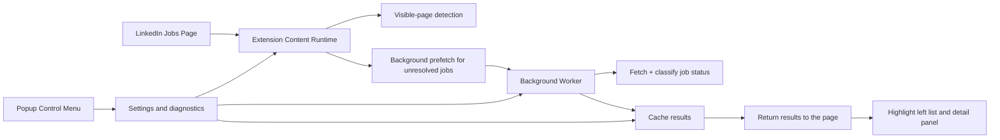

# Building a LinkedIn Reposted Marker Extension: DOM Detection, Background Prefetch, and Defensive Browser Engineering

## Introduction

Most browser extensions look simple from the outside and messy from the inside.

This one is a good example.

The goal of **LinkedIn Reposted Marker** is straightforward: detect reposted job listings on LinkedIn and surface that signal directly in the jobs list, not only inside the detail panel after a click.

In practice, that means solving a cluster of problems that show up in almost every serious browser-extension project:

- the target page is a dynamic single-page app
- the DOM changes frequently and unpredictably
- the useful signal is not always visible where the user needs it
- route shape and DOM shape are not always aligned
- background work has to be fast enough to feel helpful, but conservative enough to avoid rate limits

This post walks through the technical design of the extension, the architecture decisions behind it, and the implementation lessons that came from making it work reliably.

## The Product Problem

LinkedIn often exposes the reposted signal most clearly inside the job detail panel, but the real user need exists one step earlier:

> “Can I tell this is a reposted job before I spend attention opening it?”

That changes the technical problem.

A basic DOM-only extension could highlight reposted text if it is already visible in the left-hand list. But a useful version has to go further:

1. detect reposted status from visible DOM when possible
2. infer it from the open detail panel when the user clicks into a job
3. prefetch unresolved jobs in the background so the left list improves over time
4. keep everything stable while LinkedIn rerenders the page during scroll, route changes, and async updates

That is where the extension architecture comes from.

## High-Level Architecture

The extension has four major runtime pieces:

1. **Content runtime**
   This runs on supported LinkedIn jobs pages. It scans job cards, detects visible reposted signals, maps job cards to job IDs, and applies highlighting to both the list and the detail panel.

2. **Background worker**
   This handles asynchronous prefetch work for unresolved jobs. It validates incoming requests, applies queue policy, fetches LinkedIn job pages, and returns results to the content runtime.

3. **Shared policy layer**
   This centralizes route support, payload validation, cache replacement rules, timing constants, and debug log behavior so that content and background logic stay consistent.

4. **Popup control menu**
   This gives the user runtime controls and visibility into system state: enable/disable behavior, prefetch tuning, cache TTL, queue diagnostics, cache clearing, and debug log export.

At a product level, the runtime flow looks like this:

The key design choice is that **background prefetch augments DOM detection instead of replacing it**. The extension remains useful even if background fetch is disabled or temporarily rate-limited.

## Why DOM-First Was the Right Starting Point

A lot of extension projects fail because they start with the most “clever” part first.

For this extension, the tempting path was to jump immediately into background fetch and indirect classification. That would have been a mistake.

The DOM-first model was the correct foundation for three reasons:

1. It validates the user experience early.
   If highlighting reposted jobs is not visually useful in the left list and detail panel, the rest of the system is irrelevant.

2. It establishes a stable mapping model.
   Before doing background work, the extension needs to know what a “job card” actually is, how to locate it, how to identify it, and how to update it later.

3. It creates a fallback path.
   Background prefetch is inherently more fragile because it depends on network behavior, route support, throttling, and LinkedIn response shape. DOM detection provides graceful degradation.

That is why the project evolved in phases: visible detection first, then job identity and cache, then background prefetch, then performance controls.

## The Real Difficulty: LinkedIn Is Not a Stable Document

The hardest part of this extension is not matching the word `Reposted`.

It is handling LinkedIn as a dynamic application rather than a static page.

The implementation has to survive:

- infinite scroll
- async DOM insertion
- rerendered card containers
- route changes without full reloads
- different page variants such as `/jobs/search/` and `/jobs/search-results/`

That is why the content runtime uses:

- a debounced `MutationObserver`
- scroll-driven rescanning
- route polling
- data attributes to track extension-owned state
- a card registry keyed by job ID

Without that, the extension would either miss updates or re-apply work constantly and create flicker.

## Job Identity: The Backbone of Everything

Once the extension moved beyond purely visible DOM detection, **job identity became the critical internal primitive**.

If a job can be reliably represented by a stable `jobId`, then the extension can:

- cache results
- reapply known status to rerendered cards
- connect detail-panel detection back to the left-side card
- deduplicate background queue work
- resolve later async results against the correct DOM node

The implementation extracts job IDs from multiple places because LinkedIn does not always expose them in the same way:

- `/jobs/view/<id>` URL paths
- `currentJobId` query parameters
- `data-*` attributes and URN-like fields in the DOM

This ended up mattering a lot in `search-results` routes, where URL shape and selected-card behavior differ from the simpler `/jobs/search/` flow.

One of the clearest lessons from the project is this:

> If the job identity layer is weak, everything above it becomes probabilistic.

## Background Prefetch: Useful, but Dangerous

Background prefetch is the feature that makes the extension genuinely better than a simple UI highlighter.

It allows the left list to improve asynchronously as unresolved jobs are fetched and classified.

But background prefetch also introduces the system’s biggest operational risk: **sending too many requests**.

That risk showed up in practice through HTTP `429 Too Many Requests` responses. The fix was not just “slow it down a bit.” It required an explicit queue model and retry policy:

- bounded pending queue
- configurable concurrency
- minimum interval between requests
- pause window on rate limiting
- cooldowns for `error` and `rate_limited` states
- cache reuse before issuing new work
- viewport-aware candidate selection so the extension only prefetches nearby jobs

This turned prefetch from an eager fire-and-forget feature into a managed subsystem.

That is an important engineering distinction.

The question is not:

> “Can we fetch unresolved jobs in the background?”

The real question is:

> “Can we do it predictably, safely, and in a way that still feels responsive?”

## Viewport Windowing and Queue Control

After basic prefetch was working, performance became the next problem.

If every unresolved card on a long job list can be queued immediately, then the extension is technically functioning but operationally wrong. It wastes work on jobs the user may never see, increases rate-limit risk, and makes queue behavior harder to reason about.

That led to a more disciplined model:

- only queue jobs near the viewport
- score candidates by distance from the viewport
- prioritize closer cards first
- cap the maximum pending queue size
- opportunistically refresh stale cached results for nearby jobs only

This is a common pattern in systems that look UI-driven but actually need resource scheduling.

The extension does not just detect jobs. It also decides **which unresolved jobs are worth spending background budget on right now**.

## Route Support: Saying “No” Is Part of Reliability

One of the cleaner engineering decisions in the codebase is explicit route support.

The extension does not pretend every LinkedIn Jobs route is equally supported. Route validation is centralized in a shared contracts layer, and unsupported pages are intentionally gated off.

At the moment:

- `/jobs/search/` is supported
- `/jobs/search-results/` has historically been trickier and required multiple hardening passes
- unsupported routes are surfaced in the popup instead of silently misbehaving

This matters because many browser extensions fail in a subtle way: they partially work on pages they were never really designed for.

The better behavior is:

1. be explicit about what is supported
2. enforce that contract in both content and background boundaries
3. expose support state to the user

That reduces ambiguity and makes debugging much simpler.

## Popup Controls and Runtime Introspection

The popup is not just a settings page. It is also an operator console.

The extension exposes:

- enable/disable toggle
- background prefetch toggle
- left-list and detail-panel marking toggles
- prefetch window
- prefetch concurrency
- cache TTL
- page support state
- queue state
- cache state
- cache clearing
- debug log export

This is useful for two reasons.

First, it makes the extension practical for real users. They can tune aggressiveness or turn off behavior they do not want.

Second, it makes the system diagnosable. That matters because a browser extension has two audiences:

- the end user
- the maintainer trying to understand why something did not update correctly

Those needs often overlap.

## Debug Logging as a Product Feature

This project ended up needing more runtime visibility than a few `console.log` statements could provide.

A shared debug log was added so that event history can be stored locally and exported as JSON from the popup.

That log captures things like:

- settings changes
- content runtime initialization
- queue enqueue / release / drop behavior
- fetch completion and rate-limiting events
- status result delivery back to the content runtime

That may sound like internal tooling, but for a browser extension it becomes part of the product quality story.

The more dynamic and asynchronous the system becomes, the more valuable it is to have a durable local event trail instead of trying to reconstruct behavior from a live DevTools session.

## The Hardest Bugs Were Mapping Bugs

The most persistent issues were not styling bugs. They were mapping bugs.

The extension repeatedly ran into variations of this failure mode:

- the right-side detail panel correctly shows a reposted signal
- the left-side card should be updated
- but the extension cannot confidently map the detail result back to the correct card

Several hardening steps came out of that:

- support multiple job ID sources
- treat `search-results` as a special route family
- use selected-card heuristics when route behavior differs
- fall back to title/company matching when job ID mapping is weak
- avoid accidentally treating detail DOM nodes as left-list cards

This is a good reminder that in UI-heavy browser extensions, **state synchronization bugs often matter more than detection bugs**.

Finding the signal is only half the problem. Applying it to the right place is the real challenge.

## Why This Architecture Works

The current architecture works because it is layered in a disciplined way:

- **DOM detection** handles the obvious cases cheaply
- **job identity and registry** stabilize updates across rerenders
- **background prefetch** improves coverage
- **cache policy** prevents repeated work and controls replacement
- **queue policy** prevents the prefetch subsystem from becoming unstable
- **popup controls and debug logs** make the runtime observable and tunable

None of those pieces are individually surprising.

What matters is that they cooperate under the real constraints of a modern browser extension:

- unstable target DOM
- asynchronous UI updates
- multiple runtime contexts
- background request limits
- user-facing latency expectations

## Lessons for Other Browser Extensions

If you are building a browser extension against a large SPA, the most transferable lessons from this project are:

### 1. Start with the user-visible core

Do the simplest useful thing first. In this project, that was visible DOM detection and highlighting.

### 2. Treat identity as infrastructure

If the system needs to reconnect async work back to the DOM later, stable identity is not optional.

### 3. Build background work as a controlled subsystem

Anything that fetches in the background needs queue policy, cache policy, and rate-limit behavior from the start.

### 4. Be explicit about support boundaries

A route support matrix is better than quietly “kind of” supporting everything.

### 5. Observability is worth it even in a small extension

Once the system spans popup, content runtime, background worker, and storage, debugging without durable logs becomes unnecessarily painful.

## Closing Thoughts

LinkedIn Reposted Marker started as a focused utility, but it quickly turned into a compact example of defensive extension engineering.

The interesting part is not that it can highlight reposted jobs. The interesting part is how much supporting architecture is required to make that simple feature feel reliable on top of a dynamic site that does not particularly want to be scraped, inferred, or stabilized.

That is the real work in browser extensions:

not just adding behavior to a page, but building a small, resilient system that can keep doing the right thing while the page changes underneath it.
