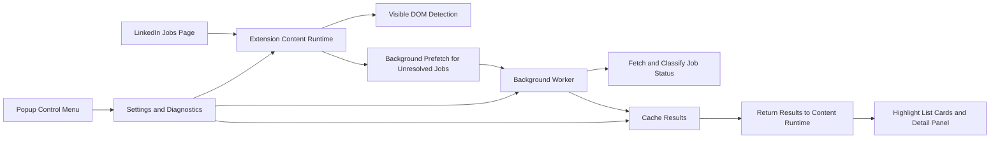

[GitHub Link](https://github.com/pinkpig777/reposted-marker)

## Introduction

Most browser extensions look simple from the outside.

Then you open the codebase and realize the browser is basically a haunted house with event listeners.

**LinkedIn Reposted Marker** started with a simple goal: help users identify reposted LinkedIn jobs directly from the jobs list, before they waste time clicking into each post.

The idea is straightforward:

> If a job is reposted, show that signal earlier.

But building that reliably was not just a matter of finding the word `Reposted`.

LinkedIn is a dynamic single-page app. The page changes while you scroll, cards rerender, routes change without full reloads, and useful information sometimes appears only in the detail panel after a job is opened.

So this small extension slowly turned into a real browser-extension engineering problem:

- detect reposted jobs from visible DOM when possible
- connect detail-panel signals back to the correct list card
- prefetch unresolved jobs in the background
- avoid sending too many requests
- keep highlights stable across scrolls, route changes, and rerenders
- give the user enough controls and diagnostics to understand what is happening

This post walks through how the extension is designed, why the architecture ended up this way, and what I learned from making it reliable enough to use.

## The Product Problem

The core user problem is simple:

> “Can I know this job is reposted before I spend attention opening it?”

LinkedIn may show the reposted signal inside the job detail panel, but by that point the user has already clicked.

That is too late.

A basic extension could highlight reposted text if it is already visible in the left-side job list. That is useful, but limited. A better version needs to do more:

1. detect reposted status from visible job cards
2. detect status from the opened job detail panel
3. map the detail-panel result back to the correct left-side card
4. prefetch unresolved jobs in the background
5. keep the UI stable while LinkedIn constantly mutates the page, because apparently static HTML was too peaceful for humanity

That product need shaped the whole architecture.

## High-Level Architecture

The extension has four main runtime pieces:

1. **Content runtime**

   This runs directly on supported LinkedIn jobs pages. It scans job cards, extracts job IDs, detects visible reposted signals, and applies visual markers to both the left-side list and the right-side detail panel.

2. **Background worker**

   This handles async prefetching. When the content script finds unresolved jobs, it can ask the background worker to fetch and classify those jobs without blocking the page.

3. **Shared policy layer**

   This centralizes route support, payload validation, cache rules, timing constants, and debug behavior. Without this layer, content and background logic would slowly drift apart, because duplicated logic always finds a way to embarrass you later.

4. **Popup control menu**

   This gives the user runtime controls and diagnostics: enable/disable behavior, prefetch tuning, cache TTL, queue state, cache clearing, and debug log export.

The runtime flow looks like this:

The important design decision is this:

> Background prefetch should improve DOM detection, not replace it.

That means the extension still works even if prefetch is disabled, paused, rate-limited, or temporarily unavailable.

## Why I Started with DOM Detection

The most tempting path was to start with background fetching first.

That would have been the fun, over-engineered version. Naturally, also the wrong starting point.

The right starting point was visible DOM detection.

There were three reasons.

First, it validated the product quickly. If marking reposted jobs in the list was not actually useful, there was no point building a bigger system around it.

Second, it forced me to solve the basic page-mapping problem. Before doing async work, the extension needed to understand what a job card is, how to find it, how to extract its identity, and how to update it later.

Third, DOM detection gave the extension a fallback path. Background prefetch depends on network behavior, route support, cache state, and rate limits. DOM detection is cheaper, faster, and less fragile.

So the project evolved in layers:

1. visible detection
2. stable job identity
3. cache and registry
4. background prefetch
5. queue control
6. popup controls and debug logging

That order mattered.

## The Real Difficulty: LinkedIn Is Not a Stable Document

The hard part was not checking whether text includes `Reposted`.

The hard part was dealing with LinkedIn as a moving application instead of a static webpage.

The extension has to survive:

- infinite scroll
- async DOM insertion
- rerendered job cards
- route changes without full page reloads
- different job page variants
- detail panels that do not always expose identity cleanly

To handle that, the content runtime uses:

- a debounced `MutationObserver`
- scroll-driven rescanning
- route polling
- extension-owned data attributes
- a card registry keyed by job ID
- careful separation between list cards and detail-panel DOM

Without those pieces, the extension would either miss updates or keep applying the same work again and again.

That usually leads to flicker, stale markers, duplicate tags, or all the tiny UI disasters that make users uninstall things with impressive speed.

## Job Identity Is the Backbone

Once the extension moved beyond visible DOM detection, job identity became the most important internal primitive.

If a job can be represented by a stable `jobId`, then the extension can:

- cache results
- deduplicate background requests
- reapply status after rerenders
- connect detail-panel detection back to the left-side list
- resolve async background results against the correct card
- avoid marking the wrong job

The extension extracts job IDs from multiple sources because LinkedIn does not always expose them consistently:

- `/jobs/view/<id>` URL paths
- `currentJobId` query parameters
- DOM attributes
- URN-like fields
- selected-card structures

This mattered during route investigation, especially when comparing supported `/jobs/search/` behavior with unsupported route variants where URL shape and selected-card behavior differ.

The main lesson was simple:

> If the identity layer is weak, everything above it becomes guesswork.

And guesswork is not architecture. It is just hope wearing a hoodie.

## Background Prefetch: Helpful, but Risky

Background prefetch is what makes the extension more than a simple highlighter.

It lets the extension improve the left-side job list over time by fetching unresolved jobs in the background and classifying their reposted status.

But it also introduces the biggest operational risk:

> too many requests.

In practice, that showed up through HTTP `429 Too Many Requests` responses.

The fix was not just slowing everything down randomly. The extension needed an actual queue and retry model:

- bounded pending queue
- configurable concurrency
- minimum interval between requests
- pause window after rate limiting
- cooldowns for `error` and `rate_limited` states
- cache reuse before new fetches
- viewport-aware candidate selection
- stale-result refresh only when it is worth it

This changed prefetch from a reckless fire-and-forget feature into a controlled subsystem.

The real engineering question was not:

> “Can we fetch unresolved jobs?”

It was:

> “Can we fetch them predictably without annoying LinkedIn, the browser, or the user?”

Small distinction. Large consequences.

## Viewport Windowing and Queue Control

Once prefetch worked, the next problem was deciding what should be prefetched.

A long LinkedIn jobs page can contain many unresolved cards. Queueing all of them immediately would technically work, but it would be wasteful and fragile.

Most of those jobs may never enter the user’s attention.

So the extension uses a viewport-aware model:

- only queue jobs near the current viewport
- score candidates by distance from the viewport
- prioritize closer cards first
- cap the maximum pending queue size
- reuse cached results aggressively
- refresh stale cached results only for nearby jobs

This makes the extension behave more like a small scheduler than a simple DOM script.

It is not just asking:

> “Which jobs are unresolved?”

It is asking:

> “Which unresolved jobs are worth spending background budget on right now?”

That distinction makes the extension much more stable.

## Route Support: Saying No Improves Reliability

One of the better decisions was to make route support explicit.

The extension does not pretend every LinkedIn Jobs page works the same way. It centralizes route validation in a shared contracts layer and gates unsupported routes instead of silently misbehaving.

Currently, the main supported route is:

- `/jobs/search/`

The extension intentionally does not support `/jobs/search-results/` because its selected-card behavior and URL patterns are less reliable for this implementation.

This is the kind of detail that sounds boring until you debug a browser extension at midnight and realize half your bugs come from pages you never meant to support.

The better behavior is:

1. define supported routes clearly
2. enforce the same support contract in content and background code
3. show support state in the popup
4. fail visibly instead of pretending everything is fine

That makes bugs easier to reason about and prevents the extension from becoming a pile of lucky assumptions.

## Popup Controls and Runtime Introspection

The popup is not just a settings menu.

It is also a small operator console.

It exposes:

- extension enable/disable
- background prefetch toggle
- left-list marking toggle
- detail-panel marking toggle
- prefetch window size
- prefetch concurrency
- cache TTL
- route support state
- queue state
- cache state
- cache clearing
- debug log export

This helps in two ways.

First, users can tune how aggressive the extension should be.

Second, the system becomes diagnosable. That matters because browser extensions have multiple runtime contexts:

- content script
- background worker
- popup
- browser storage
- target page DOM

When something goes wrong, the reason may live in any of those places, because apparently one runtime context was not enough suffering.

## Debug Logging Became a Product Feature

At first, normal `console.log` debugging was enough.

Then the system grew.

Once prefetching, queue policy, cache state, route support, and popup controls were all interacting, DevTools logs were not enough anymore.

So the extension added a shared debug log that stores useful runtime events locally and allows exporting them as JSON from the popup.

The log captures things like:

- settings changes
- content runtime initialization
- route support decisions
- queue enqueue, release, and drop behavior
- fetch completion
- rate-limit events
- status result delivery back to the content runtime

This sounds like internal tooling, but for a browser extension it becomes part of the product quality.

If a user says, “This job did not update,” a durable local event trail is much better than asking them to recreate the issue while DevTools is open.

Nobody wants that. Not even the browser.

## The Hardest Bugs Were Mapping Bugs

The most persistent bugs were not styling bugs.

They were mapping bugs.

A common failure looked like this:

1. the right-side detail panel correctly showed a reposted signal
2. the extension detected it
3. the left-side job card should have been updated
4. but the extension could not confidently map the detail result back to the correct card

That led to several hardening steps:

- extract job IDs from multiple sources
- explicitly gate unsupported route families such as `search-results`
- avoid relying on selected-card heuristics for unsupported routes
- fall back to title and company matching when job ID mapping is weak
- avoid accidentally treating detail-panel elements as list cards
- maintain a registry of known cards by job ID

The lesson here is important:

> Finding the signal is only half the problem. Applying it to the right place is the real work.

In UI-heavy browser extensions, synchronization bugs often matter more than detection bugs.

## Why This Architecture Works

The current architecture works because each layer has a clear job:

- **DOM detection** handles obvious visible cases quickly
- **job identity** gives the system a stable internal key
- **card registry** reconnects status to rerendered DOM nodes
- **background prefetch** improves coverage
- **cache policy** avoids repeated work
- **queue policy** prevents request spikes
- **route support** keeps behavior honest
- **popup controls** make the system tunable
- **debug logs** make the system observable

None of these pieces are individually fancy.

The value comes from how they work together under real browser-extension constraints:

- unstable target DOM
- asynchronous UI updates
- multiple runtime contexts
- background request limits
- user-facing latency expectations
- page behavior the extension does not control

That is what made the project interesting.

Not the word matching. Not the red styling. The actual work was making the system keep doing the right thing while LinkedIn kept changing underneath it.

## Lessons for Other Browser Extensions

Here are the lessons I would reuse in future browser-extension projects.

### 1. Start with the user-visible core

Build the simplest thing that creates real user value.

For this project, that was marking visible reposted jobs. Everything else came after that.

### 2. Treat identity as infrastructure

If async work needs to reconnect back to the page later, stable identity is not optional.

A weak identity model will leak bugs everywhere.

### 3. Do not let background work run wild

Background fetching needs rules:

- queue limits
- cache reuse
- retry policy
- rate-limit handling
- prioritization

Otherwise, it becomes chaos with a network tab.

### 4. Be honest about support boundaries

A route support matrix is better than pretending every page variant works.

Partial support should be explicit.

### 5. Build observability early

Once an extension spans content scripts, background workers, popup UI, storage, and a dynamic target page, debugging without logs becomes painful fast.

Small projects still deserve good diagnostics.

## Closing Thoughts

LinkedIn Reposted Marker started as a small utility.

The original idea was just:

> highlight reposted jobs so users can avoid wasting time.

But making that simple feature reliable required a real architecture:

- DOM scanning
- identity extraction
- card mapping
- background prefetch
- cache policy
- queue control
- route gating
- popup controls
- debug logs

That is the real lesson from this project.

Browser extensions are not just little scripts you inject into a page. At least, not if you want them to survive real-world usage.

They are small distributed systems running inside a browser, attached to someone else’s constantly changing application, trying to be helpful without breaking things.

Which is ridiculous.

But also kind of fun.
